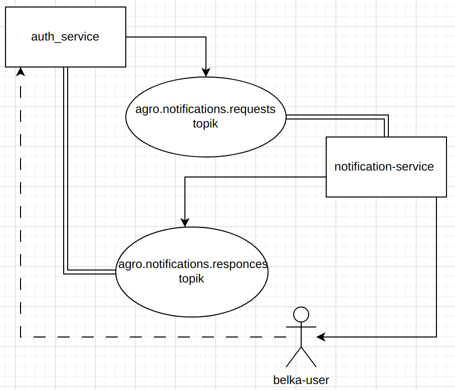

# Notification Service

универсальный сервис расслыки уведомлений 

## Задачи

- базовый API, который будет реализован - расслыка писем через SMTP 
- покрыть всё тестами (ДЖркин скрипты для обработки тестов, такие же интограционые тесты(Кукумбер фрайворк написаны тесты на джеркине))
конифиги дежат в image manager
## Технологический стек

- **Kafka**
- **Spring boot**
- **MySQL?**

## Развитие

- чтобы отправить письмо, нужно передавать всё содержимое через топик, который в свою очередь передаст это сервису.
Можно будет подключить сервис к базе данных **MySQL?(если чётко вытсраю сущности) Mongo?(гипкие параметры)**.
И тогда можно реализовать систему, в которой другим сервисам нужно будет просто передавать бизнес ключи.
(ключ: verification, требует n параметров)
- допустим сервис знает какие данные нужно послать и параметры, но не знает куда и кому, 
тогда он посылает в топик с ключём "недоделано" другой топик это ест, что-то добавляет и обратно 
зкидывает в топик.(event soursing?) заключительным этапом формирования будет либо сервис профилей либо ауф сервис
## Запуск и настройка

(Добавить инструкции по установке и запуску сервиса)

